# 🎮✨ 在GitHub上共筑游戏宇宙！✨🎮

🌟 项目简介
这是一个基于GitHub的开源游戏共创计划，旨在打造一个不断生长的多元游戏宇宙！

🚀 主要功能
- 通过GitHub分支系统进行游戏开发协作
- 提供素材分支(assets-*)用于共享游戏资源
- 支持个人开发分支(dev-*)和协作分支(collab-*)

🛠️ 技术栈
- GitHub版本控制和CI/CD
- 支持Unity和Godot游戏引擎

📜 参与方式
1. 贡献素材到公共分支
2. 创建个人游戏分支
3. 通过Pull Request进行协作

🌌 愿景
"在GitHub的星空中，每个仓库都是一个世界"

➡️ 访问主仓库: <mcurl name="Let's-make-a-game-together" url="https://github.com/TEWER816/Let-s-make-a-game-together"></mcurl>

> **没有边界，只有创造——用GitHub分支打造你的游戏世界！**

---

## 🌟 这是什么？
这是一个 **完全基于GitHub** 的开源游戏共创计划！  
你可以：
- 🖌️ **直接提交PR到素材分支**（角色/场景/音效...）  
- 🕹️ **在个人分支开发完整游戏**  
- 🧩 **Fork他人仓库二次创作**  
- 🤝 **通过Pull Request协作**  

**最终目标**：在GitHub上打造一个不断生长的 **多元游戏宇宙**！

---

## 📜 GitHub协作规则
### 核心原则
```diff
+ 所有创作通过GitHub仓库管理
+ 主仓库：[https://github.com/GameUniverse/Main](https://github.com/TEWER816/Let-s-make-a-game-together/tree/main?tab=readme-ov-file)
- 非开源内容不得提交
```

### 分支结构
| 分支类型 | 命名规范 | 用途 |
|----------|----------|------|
| **主分支** | `main` | 稳定版本 |
| **素材分支** | `assets-类型` | 存放共享素材 |
| **游戏分支** | `dev-用户名-游戏名` | 个人开发空间 |
| **协作分支** | `collab-项目名` | 多人协作项目 |

### 内容许可
```!
所有提交必须包含：
1. LICENSE文件（推荐MIT/CC BY 4.0）
2. 清晰的README说明
3. 合规的版权声明
```

---

## 🚀 如何参与？
### 第一步：贡献素材到公共分支
1. Fork主仓库：(https://github.com/TEWER816/Let-s-make-a-game-together/tree/main?tab=readme-ov-file)
2. 找到对应素材分支：
   - 角色：`assets-characters`
   - 场景：`assets-environments`
   - 音效：`assets-sounds`
3. 添加你的素材文件
4. 提交Pull Request

[](https://github.com/TEWER816/Let-s-make-a-game-together)

### 第二步：创建个人游戏分支
```bash
# 克隆主仓库
git clone https://github.com/TEWER816/Let-s-make-a-game-together/tree/assets-characters

# 创建个人开发分支
git checkout -b dev-你的用户名-游戏名

# 开发完成后推送到GitHub
git push origin dev-你的用户名-游戏名
```

[](https://github.com/GameUniverse/Main/branches/new)

### 第三步：协作开发
1. 浏览公共分支：https://github.com/GameUniverse/Main/branches
2. Fork感兴趣的开发分支
3. 创建功能分支进行修改
4. 向原分支提交Pull Request

---

## 💻 GitHub开发工作流
### 标准协作流程

```mermaid
graph LR
A[Fork主仓库] --> B[创建开发分支]
B --> C{开发类型}
C -->|素材| D[提交PR到 assets-*]
C -->|游戏| E[推送到 dev-*]
D --> F[审核合并]
E --> G[邀请协作者]
```


### 常用Git命令
| 操作 | 命令 | 说明 |
|------|------|------|
| **同步主分支** | `git pull upstream main` | 保持最新 |
| **提交素材** | `git add assets/; git commit -m "添加新角色"` |  |
| **发起协作** | `gh pr create --base collab-project --head your-feature` | GitHub CLI |
| **解决冲突** | `git rebase main` |  |

---

## 🏆 GitHub创作者权益
| 基础权益 | 高级权益 |
|----------|----------|
| 🌟 **GitHub Profile展示** | 🏆 **精选项目推广** |
| 🔄 **完整版本历史** | 💬 **专属讨论区** |
| 🤖 **GitHub Actions CI/CD** | 🚀 **免费云测试环境** |
| 📊 **贡献度统计** | 💰 **GitHub Sponsors支持** |

---

## 🌈 愿景宣言
> **"在GitHub的星空中，每个仓库都是一个世界"**  
我们相信：  
- 💻 **代码即创作**  
- 🤝 **PR即协作**  
- 🌐 **分支即宇宙**  

---

## ⏳ 立即行动！
```diff
# 克隆宇宙起点
+ git clonehttps://github.com/TEWER816/Let-s-make-a-game-together
# 创建你的世界
+ git checkout -b dev-你的用户名-游戏名
# 开启创造之旅
+ code .
```

➡️ **访问主仓库**：[GitHub游戏宇宙](https://github.com/GameUniverse/Main)  
📢 加入开发者社区：  
[](https://discord.gg/gameuniverse) 
[](https://gameuniverse.slack.com)

> 🌌 你的commit，就是宇宙的星辰  
> ⭐ 每个star，都在点亮新世界

---

## 🛠️ 技术栈支持

```mermaid
graph TD
A[GitHub] --> B[版本控制]
A --> C[CI/CD]
A --> D[项目管理]
E[Unity] --> F[.github/workflows]
G[Godot] --> H[导出模板]
```


## 📅 宇宙扩张计划
| 阶段 | 目标 | 预计时间 |
|------|------|----------|
| **星尘** | 基础分支系统 | 2025 Q9 |
| **星系** | 跨游戏素材共享 | 2025 Q10 |
| **宇宙** | 实时协作编辑器 | 2026 10 |

## 💻 开发工具支持
### 主流编程语言编译器
| 语言 | 官方下载 | 跨平台支持 | 游戏开发适用性 |
|------|----------|------------|----------------|
| **Python** | [python.org](https://www.python.org/downloads/) | Windows/macOS/Linux | 🎮 脚本/工具开发 |
| **JavaScript** | [nodejs.org](https://nodejs.org/) | Windows/macOS/Linux | 🌐 网页游戏开发 |
| **C#** | [.NET SDK](https://dotnet.microsoft.com/download) | Windows/macOS/Linux | ⚔️ Unity引擎首选 |
| **Java** | [OpenJDK](https://jdk.java.net/) | Windows/macOS/Linux | 📱 安卓游戏开发 |
| **C++** | [MinGW](https://www.mingw-w64.org/) / [MSVC](https://visualstudio.microsoft.com/) | Windows/macOS/Linux | 🚀 高性能游戏引擎 |
| **GDScript** | [Godot Engine](https://godotengine.org/download) | Windows/macOS/Linux | 🕹️ Godot原生语言 |
| **Lua** | [LuaBinaries](https://luabinaries.sourceforge.net/) | Windows/macOS/Linux | 🔧 游戏脚本扩展 |

### 游戏引擎工具包
[](https://unity.com/download)
[](https://www.unrealengine.com/download)
[](https://godotengine.org/download)

---

